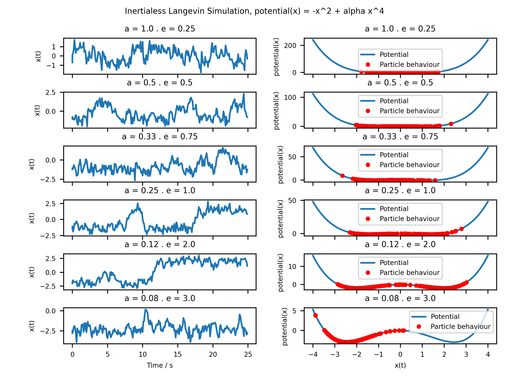

# A playground for experiments in Statistical Mechanics

## Metropolis Monte Carlo

An example system with two spin states (energies 0 and 1). 

## Random Walk

A simple model of a continuum random walk

## Squashing a polymer

Using the previous model, we imagine the random walk as a polymer with several links in between two plates. By counting a subset of random walks that lie between the two plates, we can estimate the partition function. This allows us to estimate the free energy and hence the force keeping the plates apart.

## Inertialess Langevin Simulation

In this case, we consider a particle in a 1D potential with a barrier between two adjacent potential wells. Here we look at the behaviour and crossover time for various barrier heights. 

## 1D Traffic Flow (a.k.a Rule 184)

This model examines traffic flows which examines flow as a series of "spins" at lattice sites. 

## 2D Traffic Flow (The Biham-Middleton-Levine Model)

This model plots traffic on a 2D lattice where red cars can move only right and blue cars can move only down, with red cars moving first. 

## Diffusion-Limited Aggregation

This example of aggregation involves a crystal seed surrounded by aggregation sites. Particles "diffuse" (i.e. undergo a random walk outside the radius of the structure and join the structure if the random walk intersects an aggregation site. 

## Schelling Model

The Schelling Model simulates urban segregation using a simple model of random movements using the "similarity" (i.e. what proportion of neighbouring cells must be of the same colour for a household to be 'satisfied')

## Sznajd Model

This is a simple model of groupthink which uses the simple "spin" model of opinion. At each step, sites are selected at random. If the site and its neighbour to the right agree, their neighbours copy their opinion. If they do not agree, the outer neighbours disagree with their immediate neighbour (i.e. disagreement leads to further disagreement).

